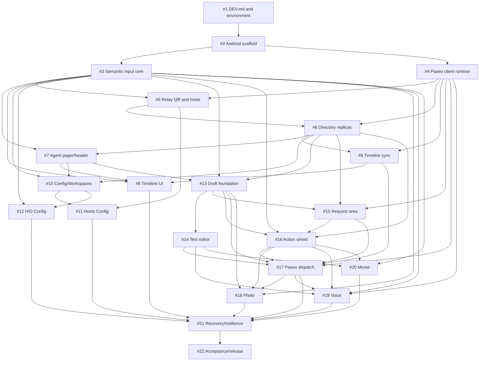

# Glasseo Milestones and Ticket DAG

This document converts the frozen `SPEC.md` into product-level milestones and GitHub ticket boundaries.

The issue dependency DAG controls readiness. Milestone numbering groups outcomes; it does not force a strict waterfall between independent tickets.

## Readiness rule

- #1 is Manager-owned and establishes the verified `DEV.md` contract.
- No implementation ticket becomes `ready-for-agent` until #1 is complete and the CTO has reconciled that ticket against `DEV.md`.
- Before dispatch, the Manager proposes a concurrent-ready batch and the CTO writes a detailed implementation-plan comment on every issue in that batch, following `AGENTS.md`.
- Issue bodies define product-level boundaries. The later CTO plan defines implementation details from current repository evidence.

## M0 — Development foundation

**Goal:** establish a reproducible Android project and verified real-device development contract.

- #1 — Establish the verified development environment and canonical `DEV.md` — Manager-owned.
- #2 — Scaffold the Android app, CI, and real-device smoke APK.

**Exit:** `DEV.md` is accepted; a clean checkout builds and tests; CI is active; a debug APK launches on the target Rokid glasses.

## M1 — Paseo runtime, host connectivity, and Agent directory

**Goal:** connect Glasseo to unmodified Paseo through Relay and derive the complete cross-host Agent-page model.

- #3 — Build the seven-control input core and Rokid HUD lifecycle.
- #4 — Integrate the minimal Paseo client and protocol runtime.
- #5 — Implement Paseo Relay QR pairing and the concurrent host registry.
- #6 — Replicate Paseo projects, workspaces, and eligible agents across hosts.

**Exit:** built-in controls are qualified; standard Paseo QR pairing works; multiple hosts connect concurrently; all eligible Agents form one stable globally ordered model.

## M2 — Read-only Agent Timeline

**Goal:** deliver the default glasses experience: one readable, live, paged Timeline page per Agent.

- #7 — Implement the global Agent pager and compact two-line header.
- #8 — Implement authoritative Paseo timeline synchronization and cache.
- #9 — Render the read-only Agent Timeline and its glasses controls.

**Exit:** LEFT/RIGHT navigate Agents; headers use Paseo metadata; retained/live/paged history reconciles correctly; following, scrolling, HUD hide/wake, Draft entry, and Config entry work on-device.

## M3 — Config and input configuration

**Goal:** browse existing Paseo state, manage paired hosts, and configure optional Bluetooth HID input.

- #10 — Implement Config navigation and the Workspaces hierarchy.
- #11 — Implement the Config Hosts section, pairing entry, and host removal.
- #12 — Implement Bluetooth HID key binding and reset in Config.

**Exit:** Config mirrors all connected hosts and their Project/Workspace/Agent hierarchy; Agent activation opens the correct Timeline; host add/remove and HID binding work on-device.

## M4 — Local Draft and Paseo agent actions

**Goal:** provide the complete local Draft editor and dispatch existing Paseo Respond/Send/Steer/Interrupt operations.

- #13 — Implement per-Agent local Draft storage and three-area navigation.
- #14 — Implement the token-based Text Draft editor.
- #15 — Implement the structured Request Draft area.
- #16 — Implement the head-posture Draft action wheel and contextual resolver.
- #17 — Dispatch Respond, Send, Steer, and Interrupt through Paseo.

**Exit:** every Agent has an isolated persistent Draft; Text and Request editing match `SPEC.md`; the wheel resolves the correct action; successful/failed operations produce the specified Draft/Timeline transitions.

## M5 — Photo, Voice, and Morse

**Goal:** complete the three modal Draft input methods.

- #18 — Implement Photo mode and the local Images Draft area.
- #19 — Implement Voice mode with Paseo streaming dictation.
- #20 — Implement Morse mode and deterministic local completion.

**Exit:** all three modes are usable on the target glasses, insert only committed content into the local Draft, and integrate with ordinary Paseo submission behavior.

## M6 — Recovery and release

**Goal:** harden the complete system and produce a qualified release candidate.

- #21 — Integrate recovery, host cleanup, and multi-host resilience.
- #22 — Complete real-device acceptance, performance hardening, and release packaging.

**Exit:** process/network/daemon/host failure scenarios preserve the specified state boundaries; the complete acceptance matrix passes; release artifacts are reproducible and owner-approved.

## Dependency DAG

## Ticket index

| Issue | Milestone | Boundary | Direct dependencies |
|---|---|---|---|
| #1 | M0 | Development environment and `DEV.md` | — |
| #2 | M0 | Android scaffold, CI, smoke APK | #1 |
| #3 | M1 | Seven-control input and HUD lifecycle | #2 |
| #4 | M1 | Minimal Paseo client/protocol runtime | #2 |
| #5 | M1 | Relay QR pairing and concurrent hosts | #3, #4 |
| #6 | M1 | Project/Workspace/Agent replicas and ordering | #4, #5 |
| #7 | M2 | Agent pager and header | #3, #6 |
| #8 | M2 | Timeline synchronization and cache | #4, #6 |
| #9 | M2 | Read-only Timeline UI and controls | #3, #7, #8 |
| #10 | M3 | Config shell and Workspaces hierarchy | #3, #6, #7 |
| #11 | M3 | Hosts Config and cleanup | #5, #10 |
| #12 | M3 | HID binding Config | #3, #10 |
| #13 | M4 | Per-Agent Draft foundation and area navigation | #3, #6, #7 |
| #14 | M4 | Text token editor | #13 |
| #15 | M4 | Structured Request area | #4, #6, #13 |
| #16 | M4 | Head-posture action wheel | #3, #6, #13, #15 |
| #17 | M4 | Respond/Send/Steer/Interrupt dispatch | #4, #8, #13, #14, #15, #16 |
| #18 | M5 | Photo and Images area | #3, #13, #16, #17 |
| #19 | M5 | Voice and Paseo dictation | #3, #4, #14, #16, #17 |
| #20 | M5 | Morse and local completion | #3, #14, #16 |
| #21 | M6 | Recovery, cleanup, and multi-host resilience | #9, #11, #12, #17, #18, #19, #20 |
| #22 | M6 | Real-device acceptance and release | #21 |

## Natural concurrency points

These are dependency observations, not an approved execution schedule:

- #3 and #4 can proceed concurrently after #2.
- #7 and #8 can proceed concurrently after #6.
- #10 and #13 can proceed concurrently after #7; #9 may proceed alongside them after #8.
- #11, #12, #14, and #15 can form parallel work where the Manager confirms file ownership is disjoint.
- #18, #19, and #20 are the intended modal-input concurrent batch after their dependencies close.

The Manager determines actual batches, hosts, profiles, and maximum concurrency from current repository evidence and `DEV.md`, then obtains Project Owner approval as defined in `AGENTS.md`.
